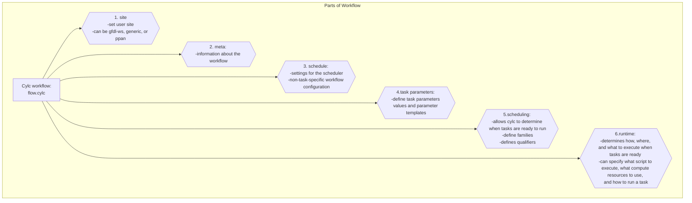
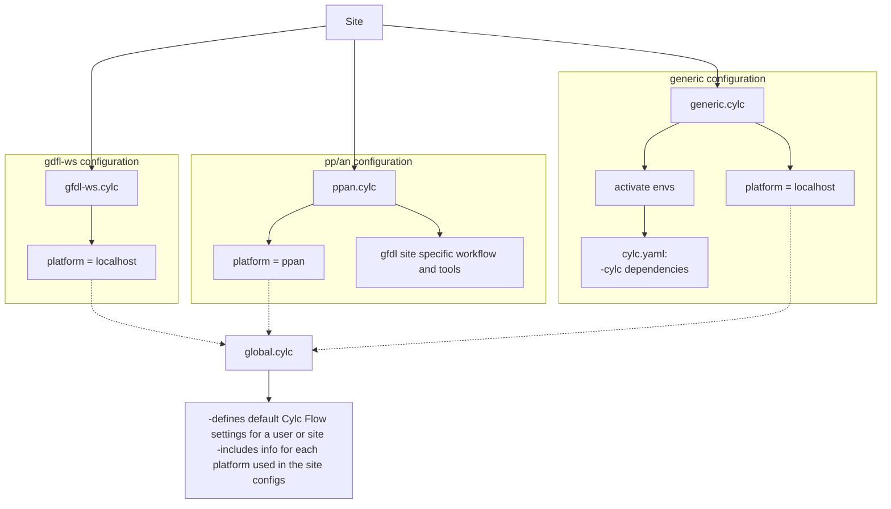

Cylc is a general purpose workflow scheduler that is very efficient for cycling systems. For more documentation, visit https://cylc.github.io/cylc-doc/stable/html. 

The usage of cylc includes configuration files: workflow configuration, global.cylc, site configurations, rose-suite configuration, and rose-suite-experiment configrations. 

The workflow configuration (flow.cylc) defines the workflow, what scripts to use throughout the workfow, and task dependencies. The global.cylc defines default cylc flow settings, including the job runner and platform information (further used in user site configurations). The site configurations define the platform to be used and other site specific user settings, such as site specific tools utilized. Furthermore, the rose-suite configuration references a default configuration file for all experiments. These settings can be applied to all experiments but can also be overwritten by experiment configurations. Rose-suite-exp. configurations include specific info for the experiment such as the history file location, the output directory location, pp components to process, etc. 

# Workflow Configuration
To help understand the workflow configuration, the following diagram was created. It is laid out in sections.



# Portable workflow 
The portable workflow (flow.cylc) was created by utilizing conda environments with workflow tools and moving gfdl site specific tools to the ppan.cylc site configuration file, in addition to creating a generic.cylc site configuration to be used in its place. 

The generic.cylc is where the conda environments containing tools needed for the workflow are activated, as seen below. The site configurations also define the platform used which references the global.cylc. As mentioned, the global.cylc contains info about the platform



# Instructions for portable workflow (Non-container use)
### 1. Install conda
```
wget https://repo.anaconda.com/miniconda/Miniconda3-latest-Linux-x86_64.sh
chmod +x Miniconda3-latest-Linux-x86_64.sh
./Miniconda3-latest-Linux-x86_64.sh
```

### 2. Install mamba
```
conda install -c conda-forge mamba
```

### 3. If not enough space, move conda directories and packages to another location 
```
conda config --add envs_dirs [location with more space] 
# EX: /collab1/data/$USER/envs for niagara

conda config --add pkgs_dirs [location with more space] 
# EX: /collab1/data/$USER/pkgs for niagara
```

### 4. Create and install environment

- Environment yaml `cylc`: includes cylc-flow, cylc-rose, metomi-rose, hsm, fre-nctools, nco, cdo, and netcdf-cxx4. To create an environment:
```
mamba env create --file cylc.yaml
conda activate cylc-task-tools                    
```

### 5. Transfer data

- Globus online was used to transfer experiment data and any other necessary data (HISTORY_DIR, PP_GRID_SPEC)

### 6. Configure pp workflow and environment
1. Create/edit pp.yaml
```
a. If not on gfdl pp/an or gaea, set site = "generic" 
b. Ensure directories, switches and other information in the pp.yaml is correct
    
    - history directory (where data files were transferred)
    - create ptmp and tmp directories 
    - HISTORY_DIR_REFINED left blank
    - DO_REFINEDIAG=False
    - pp dir
    - pp grid spec (where data files were transferred)
    - component info for regrid-xy and remap-pp-components
```    

3. TO-D0: Add `--symlink-dirs` to `cylc install` in configure scripts (optional)

    - `--symlink-dirs='run=[location with more space]'` can be added to the `cylc install` command

        - niagara-specific example: `--symlink-dirs=run=/collab1/data/$USER'`
        - edit was done due to limited space on niagara 

4. Make sure cylc conda environment is activated

```    
conda activate cylc-task-tools
```

5. Point to the global.cylc used for `generic` site 

- In generic-global-config folder in the postprocessing template repository (fre2/workflows/postprocessing/generic-global-config)

```
export CYLC_CONF_PATH=/path/to/generic-global-config
```

6. Create TMPDIR environment variable
- This is used for the stage-history task
```
export TMPDIR=/path/to/TMPDIR/tmp
```

7. Follow FRE-cli instructions on the main README.md

- ### [PP Repo README.md](https://gitlab.gfdl.noaa.gov/fre2/workflows/postprocessing#instructions-to-postprocess-fms-history-output-on-ppan-or-gaea)

8. To monitor status
- See debugging messages:
    ``` 
    cylc play --no-detach --debug [exp] 
    ```

- Monitor status of each task:
    ```
    watch -n 5 cylc workflow-state [exp]
    ```
    
# Instructions for portable workflow (Post-processing container use) (IN DEVELOPMENT - Is not fully updated yet)
### 1. Pull post-processing container from HPC-ME github
- https://github.com/NOAA-GFDL/HPC-ME

```
[docker or podman] pull [image/sif file]
```

### 2. Create ppp-setup folder
- Create directories in ppp-setup (transfer files here):
    - PPGridspec
    - history
- Copy runscript.sh from HPC-ME repo in ppp-setup (https://gitlab.gfdl.noaa.gov/fre/HPC-ME/-/tree/main/ppp?ref_type=heads)

### 3. Transfer data
- Globus online was used to transfer experiment data and any other necessary data (HISTORY_DIR, PP_GRID_SPEC)

### 4. Canopy PP steps
#### ***4a. Configure Edits***
i. pp.yaml
```
1. If not on gfdl pp/an or gaea, set site = "generic" 
2. Ensure directories, switches and other information in the pp.yaml is correct
    
    - history directory (where data files were transferred)
    - HISTORY_DIR_REFINED left blank
    - DO_REFINEDIAG=False
    - pp dir
    - pp grid spec (where data files were transferred)
    - component info for regrid-xy and remap-pp-components
```    
#### ***4b. Run the container***
```
[singularity or apptainer] exec --writable-tmpfs --bind [location/to/ppp-setup/]:/mnt [location/to/sif/file] /mnt/runscript.sh
```
